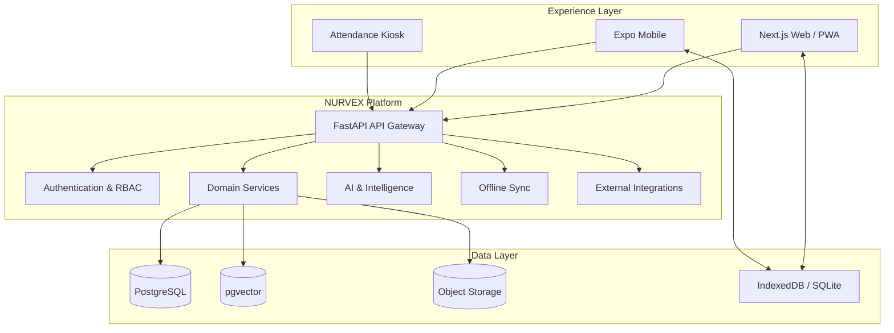

# NURVEX

<p align="center">
  
</p>

<p align="center">
  <strong>Learn. Prove. Grow. Work.</strong>
</p>

<p align="center">
  A unified digital ecosystem that connects cooperative-sector training, measurable learning outcomes, verified skills, career intelligence, and employment.
</p>

<p align="center">
  <a href="https://github.com/mittai17/Cooperative-EcoSystem">Repository</a>
  ·
  <a href="#getting-started">Getting started</a>
  ·
  <a href="#architecture">Architecture</a>
  ·
  <a href="#contributing">Contributing</a>
</p>

<p align="center">
  
  
  
  
  
  
</p>

---

## The idea

Most digital training systems end when a learner completes a course.

**NURVEX is designed around the complete outcome.**

Learning becomes evidence. Evidence becomes verified skills. Skills become career opportunities. Employment creates feedback that can improve future training.

```text
TRAINING
   │
   ├── Registration
   ├── Nomination
   ├── Enrollment
   └── Attendance
          │
          ▼
LEARNING
   │
   ├── Courses
   ├── Lessons
   ├── Assessments
   └── Progress
          │
          ▼
PROOF
   │
   ├── Competency Evidence
   ├── Certification
   └── Skill Passport
          │
          ▼
CAREER
   │
   ├── Skill Gap Analysis
   ├── Career Guidance
   └── Personalized Learning
          │
          ▼
EMPLOYMENT
   │
   ├── Job Matching
   ├── Applications
   ├── Interviews
   └── Offers
          │
          ▼
FEEDBACK
   │
   ├── Employer Feedback
   ├── Employment Outcomes
   └── Skill Demand Intelligence
          │
          └──────────────► Better Training
```

The result is a **closed-loop training-to-employment platform**, rather than a set of disconnected portals.

---

# Product

## One platform. Multiple workspaces.

NURVEX is organized around the people and organizations that operate the training ecosystem.

| Workspace | What it does |
|---|---|
| **Trainee** | Learn, attend, assess, certify, build a Skill Passport, discover careers and apply for jobs |
| **Trainer** | Manage classes, attendance, assessments, learning content, trainee progress and skill evidence |
| **Institution** | Operate programmes, batches, trainers, timetables, hostel, logistics and analytics |
| **Employer** | Define roles, discover verified candidates, match skills, run hiring workflows and provide feedback |
| **Administrator / NCCT** | Manage the ecosystem, institutions, programmes, employers, analytics, reporting and platform governance |

---

# What makes NURVEX different?

### 01 · Evidence-backed skills

A course completion is only one signal.

NURVEX can combine:

```text
Course completion
Assessment performance
Trainer evidence
Certificate
Employment feedback
        ↓
Verified skill evidence
```

A Skill Passport can therefore represent not only **what a learner says they know**, but the evidence available for that skill.

---

### 02 · Skill Graph

Skills are connected to the learning and employment ecosystem:

```text
Skills
  ↕
Courses
  ↕
Assessments
  ↕
Certificates
  ↕
Jobs
  ↕
Career Paths
```

This enables more useful recommendations than a simple course catalogue.

---

### 03 · Skill Gap Intelligence

For a target role, NURVEX can compare a learner's current evidence against role requirements.

```text
Current learner profile
          ↓
Target role requirements
          ↓
────────────────────────
Matched skills
Missing skills
Weak / developing skills
────────────────────────
          ↓
Recommended learning
```

---

### 04 · Explainable job matching

Core matching can remain deterministic.

Possible signals include:

- Required skills
- Skill proficiency
- Education
- Certifications
- Experience
- Semantic similarity where appropriate

AI can explain the result without becoming the sole authority for eligibility.

---

### 05 · Closed-loop employment feedback

A hire is not the end of the data lifecycle.

Employer feedback can become structured evidence about real-world skill demand.

```text
Employer feedback
      ↓
Observed skill demand
      ↓
Demand intelligence
      ↓
Training recommendations
      ↓
Future learners
```

This creates a feedback mechanism between **training supply** and **employment demand**.

---

# Core capabilities

## Learning

- Programme discovery and enrollment
- Self-paced and cohort learning
- Course/module/lesson structures
- Learning progress
- Integrated educational content
- DIKSHA / Sunbird integration path
- Assessment workflows
- Learning analytics

## Attendance

- QR-based attendance
- Face-recognition integration points
- Attendance events
- Kiosk/device workflows
- Online and deferred synchronization

## Assessment & certification

- Structured assessments
- Attempts and grading
- Competency evidence
- Digital certificates
- Public certificate verification
- Tamper-evident certificate integrity

## Skill intelligence

- Skill Passport
- Skill evidence
- Skill relationships
- Skill-gap analysis
- Career paths
- Learning recommendations

## Employment

- Structured job requirements
- Candidate discovery
- Explainable job matching
- Applications
- Interviews
- Offers / hiring
- Talent pools
- Employer feedback

## Operations

- Institution management
- Trainer management
- Programme management
- Timetables
- Hostel allocation
- Logistics
- Notifications
- Audit logs
- Analytics and reporting

---

# AI architecture

NURVEX follows a simple principle:

> **Use AI for intelligence and interaction; keep important platform decisions evidence-backed and reproducible.**

### AI can power

- Career guidance
- Skill-gap explanations
- Learning recommendations
- Candidate explanations
- Interview conversations
- Natural-language assistance
- Semantic retrieval

### Deterministic systems can own

- Permissions
- Certification integrity
- Structured scoring
- Skill evidence aggregation
- State transitions
- Validation
- Auditability

This separation makes AI easier to test, explain, and replace.

---

# Learning content architecture

NURVEX is designed so the learning experience stays inside NURVEX whenever the source's technical and licensing conditions allow it.

```text
                    ┌────────────────────┐
                    │ External content   │
                    │ DIKSHA / Sunbird    │
                    │ approved sources    │
                    └─────────┬──────────┘
                              │
                              ▼
                    ┌────────────────────┐
                    │ NURVEX API layer   │
                    │ normalization       │
                    │ license metadata    │
                    └─────────┬──────────┘
                              │
                              ▼
                    ┌────────────────────┐
                    │ NURVEX LMS         │
                    │ player + progress  │
                    └─────────┬──────────┘
                              │
              ┌───────────────┼───────────────┐
              ▼               ▼               ▼
            Learn          Assess          Certify
              │               │               │
              └───────────────┴───────────────┘
                              │
                              ▼
                       Skill Passport
```

External content is **not assumed to be freely redistributable**. License, attribution, embedding, translation, and storage rules must be respected per resource.

---

# Attendance architecture

NURVEX keeps hardware integrations modular.

```text
┌───────────────────────────┐
│ Attendance terminal       │
│ QR / camera / compatible  │
│ biometric hardware        │
└─────────────┬─────────────┘
              │
              ▼
┌───────────────────────────┐
│ Local edge / kiosk layer  │
└─────────────┬─────────────┘
              │
              ▼
┌───────────────────────────┐
│ FastAPI                   │
│ validation + authorization│
└─────────────┬─────────────┘
              │
              ▼
┌───────────────────────────┐
│ PostgreSQL                │
│ attendance events         │
└───────────────────────────┘
```

The platform is not designed around a single hardware vendor.

---

# Architecture



### Architecture principles

**API-first**  
Clients communicate through the backend rather than connecting directly to the database.

**Domain-oriented**  
Training, skills, employment, certification, analytics, and operations are modeled as connected domains.

**Provider-agnostic**  
External AI, content, jobs, and hardware providers are isolated behind integration boundaries.

**Offline-aware**  
The web and mobile clients can maintain local state for supported workflows and synchronize deferred operations.

**Auditable**  
Security-sensitive and important domain transitions can be logged and validated server-side.

---

# Technology stack

| Layer | Technology |
|---|---|
| Web | Next.js 16, React 19, TypeScript |
| UI | Tailwind CSS, Base UI, shadcn/ui, Lucide, Recharts |
| PWA | Service Worker, IndexedDB |
| Mobile | Expo 57, React Native 0.86 |
| Mobile state | TanStack Query, Expo SQLite, Secure Store |
| API | FastAPI, Pydantic, Uvicorn |
| Persistence | SQLAlchemy, AsyncPG, Psycopg |
| Database | PostgreSQL |
| Vector search | pgvector |
| Migrations | Alembic |
| Authentication | Clerk |
| AI | Google Gemini + deterministic engines |
| Integrity | HMAC-SHA256 |
| Containers | Docker |
| Quality | Pytest, ESLint, TypeScript, E2E scripts |

---

# Repository

```text
Cooperative-EcoSystem/
│
├── apps/
│   ├── web/
│   │   ├── public/
│   │   └── src/
│   │       ├── app/
│   │       ├── components/
│   │       └── lib/
│   │
│   └── mobile/
│       ├── src/
│       │   ├── api/
│       │   ├── features/
│       │   ├── i18n/
│       │   └── services/
│       ├── app.json
│       └── eas.json
│
├── backend/
│   ├── app/
│   │   ├── api/v1/
│   │   ├── models/
│   │   ├── schemas/
│   │   ├── services/
│   │   └── seeds/
│   ├── migrations/
│   ├── tests/
│   └── Dockerfile
│
├── docs/
├── scripts/
├── docker-compose.yml
└── README.md
```

---

# API

The platform exposes a versioned REST API under:

```text
/api/v1
```

| Domain | Prefix |
|---|---|
| Authentication | `/auth` |
| Users | `/users` |
| Organizations | `/organisations` |
| Programmes | `/programmes` |
| Courses | `/courses` |
| Learning | `/learning` |
| DIKSHA content | `/content/diksha` |
| Assessments | `/assessments` |
| Attendance | `/attendance` |
| Face workflows | `/face` |
| Certificates | `/certificates` |
| Skills | `/skills` |
| Career | `/career` |
| Jobs | `/jobs` |
| Employer | `/employer` |
| Analytics | `/analytics` |
| Administration | `/admin` |
| Timetable | `/timetable` |
| Hostel | `/hostel` |
| Logistics | `/logistics` |
| Synchronization | `/offline-sync` |
| Notifications | `/notifications` |
| Platform state | `/system` |

Interactive API documentation is available from the running service at:

```text
/docs
/redoc
/openapi.json
```

---

# Security

Security is treated as a platform capability, not a feature added at the end.

Current design principles include:

- Role-based authorization
- Organization-scoped access
- Server-side secret management
- API boundary validation
- Explicit CORS configuration
- Audit logging
- Protected certificate signing secrets
- Fail-closed access rules
- Development-only anonymous/demo modes
- Privacy-aware biometric workflows

### Roles

```text
trainee
trainer
institution
employer
admin
ncct_admin
```

> Demo authentication and anonymous actors must never be enabled against production or remote data.

---

# Certificates

Certificate issuance is connected to assessment and learning completion.

```text
Learning
   ↓
Assessment
   ↓
Pass
   ↓
Certificate
   ↓
Integrity digest
   ↓
Public verification
```

A verification identifier can be used to confirm certificate state without exposing unnecessary learner data.

---

# Offline-first capabilities

Supported offline behavior is feature-scoped.

### Web

- PWA shell
- IndexedDB caching
- Cached learning state
- Deferred mutations
- Retry and synchronization

### Mobile

- SQLite-backed local state
- Mutation outbox
- Cached course/user data
- Network-aware synchronization
- Secure local session storage

Offline operation does not imply that every action can be finalized without the server. Authoritative authorization and selected conflict-sensitive operations may remain online-only.

---

# Getting started

## Requirements

- Node.js 20+
- npm 10+
- Python 3.12+
- PostgreSQL 15+
- PostgreSQL `vector` extension
- Docker
- Expo tooling for mobile development

## Clone

```bash
git clone https://github.com/mittai17/Cooperative-EcoSystem.git
cd Cooperative-EcoSystem
```

## Backend

```bash
cd backend

python3 -m venv .venv
source .venv/bin/activate

python -m pip install --upgrade pip
pip install -r requirements.txt

alembic upgrade head
python -m app.seed

uvicorn app.main:app --host 0.0.0.0 --port 8000 --reload
```

Backend endpoints:

```text
http://localhost:8000/health
http://localhost:8000/docs
http://localhost:8000/redoc
http://localhost:8000/openapi.json
```

## Web

```bash
cd apps/web

npm ci
npm run dev
```

Open:

```text
http://localhost:3000
```

## Mobile

```bash
cd apps/mobile

npm ci
npm run typecheck
npm start
```

For a physical device, configure a backend address reachable from the device. `localhost` on a physical device refers to the device itself.

---

# Configuration

## Backend

Typical configuration includes:

```dotenv
DATABASE_URL=

APP_ENV=
LOG_LEVEL=
ALLOWED_ORIGINS=

CLERK_SECRET_KEY=
CLERK_PUBLISHABLE_KEY=
CLERK_JWT_ISSUER=

CERTIFICATE_SIGNING_SECRET=

GEMINI_API_KEY=
YOUTUBE_API_KEY=

BHASHINI_USER_ID=
BHASHINI_API_KEY=

FACE_MODEL_PACK=
FACE_MATCH_THRESHOLD=
FACE_MIN_DET_SCORE=

MEDIA_BASE_URL=
CRON_SECRET=
```

Only configure integrations you actually use.

## Web

```dotenv
NEXT_PUBLIC_API_URL=http://localhost:8000
NEXT_PUBLIC_MOCK_API=false
```

## Mobile

```dotenv
EXPO_PUBLIC_API_BASE_URL=http://192.168.1.10:8000
EXPO_PUBLIC_CLERK_PUBLISHABLE_KEY=
```

Never put private credentials into `NEXT_PUBLIC_*` or `EXPO_PUBLIC_*` variables.

---

# Development workflow

A recommended development loop:

```text
Change
  ↓
Typecheck / lint
  ↓
Unit tests
  ↓
API tests
  ↓
Database migration checks
  ↓
E2E flow
  ↓
Build
```

## Database migrations

```bash
cd backend

alembic current
alembic upgrade head
```

Create a migration only after an intentional model change:

```bash
alembic revision --autogenerate -m "describe_change"
```

Review generated migrations before applying them.

---

# Testing

## Backend

The repository includes scratch-database testing to reduce the risk of testing against a remote or production database.

```bash
docker run --name coopsetu-scratch-pg \
  -e POSTGRES_PASSWORD=postgres \
  -e POSTGRES_DB=coopsetu_scratch \
  -p 127.0.0.1:55432:5432 \
  -d pgvector/pgvector:pg16

python scripts/scratch_backend.py alembic upgrade head
python scripts/scratch_backend.py pytest -q
```

## Web

```bash
cd apps/web
npm run lint
npx tsc --noEmit
npm run build
```

## Mobile

```bash
cd apps/mobile
npm run typecheck
npm run lint
npx expo-doctor
```

## End-to-end lifecycle

```bash
API_URL=http://127.0.0.1:8000 \
INTERNAL_API_SECRET=your-development-secret \
python scripts/verify_e2e_loop.py
```

---

# Data model

NURVEX connects a broad domain model:

```text
Identity
├── Users
├── Organizations
├── Institutions
├── Trainers
├── Trainees
└── Employers

Training
├── Programmes
├── Nominations
├── Batches
├── Enrollments
├── Courses
├── Modules
├── Lessons
├── Assessments
└── Learning Progress

Operations
├── Attendance
├── Attendance Events
├── Timetables
├── Hostel
└── Logistics

Skills
├── Skills
├── Skill Relationships
├── Trainee Skills
├── Skill Evidence
├── Skill Gaps
└── Career Paths

Employment
├── Jobs
├── Job Requirements
├── Job Matches
├── Applications
├── Interviews
├── Offers
└── Employer Feedback

Trust & Analytics
├── Certificates
├── Certificate Verification
├── Skill Demand
├── Employment Outcomes
├── Notifications
├── Audit Logs
└── Offline Sync
```

---

# Production readiness

NURVEX is an actively evolving prototype. Before production deployment, validate at minimum:

- [ ] Production authentication and session handling
- [ ] HTTPS and trusted-origin CORS
- [ ] Managed PostgreSQL + pgvector
- [ ] Secret-manager integration
- [ ] Certificate key protection and rotation plan
- [ ] Database backups and restoration testing
- [ ] External integration health checks
- [ ] Biometric consent and retention policies
- [ ] Physical attendance hardware
- [ ] Offline conflict handling
- [ ] Monitoring and alerting
- [ ] Content licensing and attribution
- [ ] Privacy and data-retention policies
- [ ] High-impact AI governance and human review

---

# Roadmap

### Learning platform

- [x] Multi-role web experience
- [x] FastAPI service layer
- [x] PostgreSQL + pgvector foundation
- [x] Learning and employment domain model
- [x] Certificate integrity foundation
- [ ] Expanded DIKSHA/Sunbird content integration
- [ ] Richer learning telemetry
- [ ] Adaptive learning
- [ ] Advanced assessment analytics

### Employment intelligence

- [x] Structured jobs
- [x] Candidate matching foundation
- [x] Employer workflows
- [ ] Advanced interview workflows
- [ ] Employer feedback intelligence
- [ ] Skill-demand forecasting
- [ ] Training-to-demand optimization

### Platform scale

- [ ] Enterprise-grade observability
- [ ] Device management
- [ ] More robust offline synchronization
- [ ] Broader multilingual coverage
- [ ] Production deployment automation
- [ ] Accessibility hardening

---

# Contributing

NURVEX is built as a modular platform. Contributions should preserve clear boundaries between product domains and integrations.

### Guidelines

1. Keep changes focused and composable.
2. Reuse existing domain services before introducing duplicates.
3. Validate untrusted data at the API boundary.
4. Enforce role and organization scope on protected operations.
5. Add migrations for schema changes.
6. Add regression tests for security-sensitive behavior and state transitions.
7. Keep external provider logic behind integration boundaries.
8. Update documentation when architecture or behavior changes.

Areas that benefit from contributions include:

- DIKSHA / Sunbird integration
- Learning-player instrumentation
- Skill Graph intelligence
- Assessment analytics
- Employer intelligence
- Offline synchronization
- Accessibility
- Internationalization
- Test coverage

---

# Smart India Hackathon

**Smart India Hackathon 2026**  
**Problem Statement:** 26087  
**Theme:** Smart Education  
**Focus:** Cooperative training, ERP, LMS, skills, and employment ecosystem

NURVEX is being developed to demonstrate how cooperative-sector training can move from fragmented processes toward a connected digital lifecycle spanning learning, certification, skills, and employment outcomes.

---

# Project status

**Active development · Prototype**

Repository:

```text
https://github.com/mittai17/Cooperative-EcoSystem
```

The repository name is retained for development continuity; **NURVEX** is the product identity.

---

# Licensing

This repository currently does not contain an explicit open-source license.

Until a license is added by the maintainers, default copyright restrictions apply. Third-party services, libraries, educational resources, media, and datasets remain subject to their own licenses and terms.

---

# Vision

> **A learner should not have to navigate five disconnected systems to learn, prove their skills, and find the right opportunity.**

NURVEX aims to make that entire journey measurable:

```text
LEARN
  ↓
PROVE
  ↓
CERTIFY
  ↓
BUILD SKILLS
  ↓
DISCOVER OPPORTUNITIES
  ↓
GET HIRED
  ↓
LEARN FROM EMPLOYMENT OUTCOMES
  ↓
IMPROVE TRAINING
  ↺
```

<p align="center">
  <strong>NURVEX</strong><br>
  <sub>Learn. Prove. Grow. Work.</sub>
</p>
