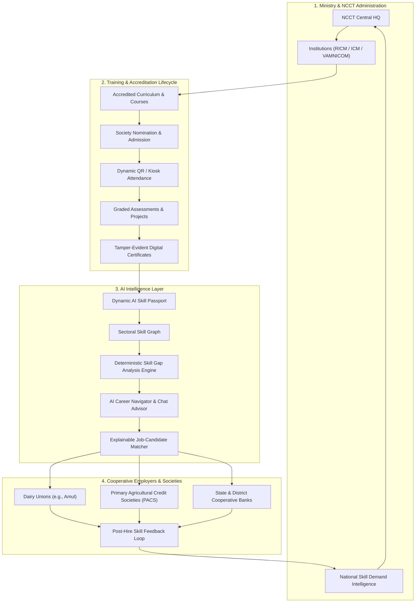

# CoopSetu AI — AI & LMS Enabled Cooperative Ecosystem

> **Smart India Hackathon (SIH) 2026 | Problem Statement: 26087**  
> *Ministry of Cooperation & National Council for Cooperative Training (NCCT)*  
> An end-to-end, AI-powered Skill Passport, LMS, and Closed-Loop Employment Ecosystem transforming cooperative training and workforce readiness across India.

---

## 📌 Executive Summary

India's cooperative sector spans over 800,000 cooperatives across agriculture, dairy, credit, marketing, and rural enterprises. However, training institutions under NCCT (such as VAMNICOM, RICMs, and ICMs) often operate in silos from employer demand, resulting in skill mismatches, unverified claims, and fragmented placement pipelines.

**CoopSetu AI** solves this through a **Closed-Loop Cooperative Learning & Employment Lifecycle**:
1. **Accredited Training & Delivery**: Program nomination, batch management, blended learning, and dynamic QR-based attendance.
2. **Dynamic AI Skill Passport**: Micro-credentialing backed by cryptographic proof, tamper-evident certificate hashes, and multi-source evidence (assessments, faculty grading, project work).
3. **Deterministic & Semantic Skill Gap Analysis**: Multi-dimensional role benchmark matching comparing verified learner competencies to target career roles.
4. **Explainable AI Job Matching**: Transparent candidate recommendations highlighting matched skills, partial gaps, and missing competencies with actionable course recommendations.
5. **Closed-Loop Employer Feedback & NCCT Intelligence**: Real-world job performance feedback loops back to update national skill demand forecasts and realign training curricula.

---

## 🏗 System Architecture & Key Innovations



### Core Innovations
1. **Dynamic AI Skill Passport (`/skill-passport`)**  
   Every learner maintains an immutable digital profile featuring competency levels (*Foundational, Intermediate, Proficient, Expert*), confidence scores (0–100%), and verifiable evidence trails linking to completed courses, tamper-proof certificates, and assessment scores.
2. **Deterministic & Explainable Skill Gap Math (`/skill-gap`)**  
   Unlike black-box generative models, CoopSetu calculates deterministic weighted match percentages against national role benchmarks, producing exact *met*, *gap*, and *missing* skill matrices with linked remedial course tracks.
3. **Tamper-Evident Public Certificate Verification (`/verify-certificate`)**  
   Unique, collision-resistant verification codes (`CST-YYYY-XXXXXXXX`) allow any employer, auditor, or cooperative society to instantly verify certificate validity, recipient identity, issue date, and certified competencies without requiring login.
4. **Dynamic QR & Offline-Ready Attendance Kiosk (`/kiosk`)**  
   Rotating time-bound QR tokens with anti-replay guarantees allow offline and edge check-ins in rural cooperative training centers, syncing back upon connectivity restoration.
5. **Closed-Loop Employer Feedback & Macro Intelligence (`/admin/skill-demand`)**  
   Post-placement performance evaluations from cooperative employers feed directly into the national skill demand aggregator, signaling emerging demand spikes (e.g., *Digital Credit Appraisal, Cold Chain Logistics, AgriTech*) to NCCT for agile curriculum redesign.

---

## 🛠 Tech Stack

| Layer | Technologies | Key Capabilities |
|---|---|---|
| **Frontend Web** | Next.js 16 (App Router), React 19, TypeScript | Server Components, Turbopack, App Shell, 6 role dashboards |
| **Styling & UI** | Tailwind CSS v4, Radix UI, Lucide Icons | Ultra-fast styling, accessible primitives, responsive dark/light theme |
| **Authentication & RBAC** | Clerk (`@clerk/nextjs`), JWT, Webhooks | 6 Role-Based Access Controls, Organization tenancy (NCCT, Institution, Employer) |
| **Database & Search** | Neon Serverless Postgres, `pgvector` (0.8.6) | Scale-to-zero serverless PostgreSQL, vector embeddings, branch-based workflows |
| **Backend API** | FastAPI (Python 3.12+), SQLAlchemy 2.0, Asyncpg | Asynchronous high-concurrency REST API, Pydantic v2 data validation |
| **Migrations** | Alembic | Fully version-controlled relational schema migrations |
| **Mobile App** | Expo (React Native), TypeScript | Cross-platform trainee learning & QR attendance on iOS & Android |
| **AI & LLM Services** | Python Skill Engine, pgvector, Google Gemini / OpenRouter | Hybrid deterministic matching + vector similarity + conversational advising |

---

## 📋 Environment Variables Configuration

Copy `.env.example` to appropriate target files:

### 1. Root & Backend Environment (`backend/.env`)
```bash
# Database (Neon Serverless PostgreSQL with pgvector)
DATABASE_URL=postgresql://<user>:<password>@<ep-branch>.ap-southeast-1.aws.neon.tech/coopsetu?sslmode=require
DATABASE_URL_PROD=postgresql://<user>:<password>@<ep-main>.ap-southeast-1.aws.neon.tech/coopsetu?sslmode=require

# Clerk Authentication & JWT Issuer
CLERK_SECRET_KEY=sk_test_...
CLERK_PUBLISHABLE_KEY=pk_test_...
CLERK_JWT_ISSUER=https://<your-instance>.clerk.accounts.dev

# AI LLM Provider Keys
GEMINI_API_KEY=AIzaSy...
OPENROUTER_API_KEY=sk-or-...

# App Runtime
APP_ENV=development
LOG_LEVEL=info
ALLOWED_ORIGINS=http://localhost:3000,http://127.0.0.1:3000,http://localhost:8000,http://127.0.0.1:8000
```

### 2. Next.js Web Frontend (`apps/web/.env.local`)
```bash
# Clerk Client Configuration
NEXT_PUBLIC_CLERK_PUBLISHABLE_KEY=pk_test_...
CLERK_SECRET_KEY=sk_test_...
CLERK_WEBHOOK_SECRET=whsec_...

# Backend Fast API Endpoint
NEXT_PUBLIC_API_URL=http://localhost:8000

# Clerk Routes
NEXT_PUBLIC_CLERK_SIGN_IN_URL=/sign-in
NEXT_PUBLIC_CLERK_SIGN_UP_URL=/sign-up
NEXT_PUBLIC_CLERK_SIGN_IN_FALLBACK_REDIRECT_URL=/dashboard
NEXT_PUBLIC_CLERK_SIGN_UP_FALLBACK_REDIRECT_URL=/dashboard
```

---

## 🚀 Local Quickstart Guide

### Prerequisites
- **Node.js** >= 20.x
- **Python** >= 3.11
- **npm** or **pnpm**
- **Git**

### Step 1: Clone & Install Dependencies

```bash
# Clone the repository
git clone https://github.com/your-org/Cooperative-EcoSystem.git
cd Cooperative-EcoSystem

# Install Web Frontend dependencies
cd apps/web
npm install
cd ../..

# Install Backend Python dependencies
cd backend
python3 -m venv .venv
source .venv/bin/activate
pip install -r requirements.txt
cd ..
```

### Step 2: Database Setup & Migrations

```bash
cd backend
source .venv/bin/activate

# Run Alembic migrations against your Neon Postgres database
alembic upgrade head

# Seed initial demonstration data (institutions, programmes, skill demands)
python3 -m app.seed
cd ..
```

### Step 3: Run the Backend Services

```bash
cd backend
source .venv/bin/activate
uvicorn app.main:app --host 0.0.0.0 --port 8000 --reload
```
API Documentation will be live at:
- Swagger UI: `http://localhost:8000/docs`
- ReDoc: `http://localhost:8000/redoc`
- Health check: `http://localhost:8000/health`

### Step 4: Run the Web Application

In a separate terminal:
```bash
cd apps/web
npm run dev
```
Open `http://localhost:3000` in your browser.

### Step 5: Run the Mobile Application (Optional)

In a separate terminal:
```bash
cd apps/mobile
npm install
npx expo start
```
Scan the QR code with the Expo Go app on your iOS or Android mobile device.

---

## 🧪 Verification & Automated Testing

CoopSetu includes automated unit tests and a dedicated 25-step closed-loop verification suite.

### 1. Run Backend Unit & Integration Tests (Pytest)
```bash
cd backend
python3 -m pytest tests/ -v
```
*Expected: 15 passing tests validating API health, skill matching engine, offline sync, and role endpoints.*

### 2. Run the 25-Step Closed-Loop E2E Verification Suite
With the backend running on port 8000:
```bash
python3 scripts/verify_e2e_loop.py
```
This tests every step of the closed-loop platform:
1. User registration & Clerk identity sync
2. Institution registration
3. Cooperative employer provisioning
4. Faculty / trainer provisioning
5. Programme definition & publication
6. Programme lookup & validation
7. Trainee programme nomination
8. Nomination review & admission approval
9. Course catalog discovery
10. Course enrollment
11. Active learning progression
12. Assessment retrieval
13. Assessment submission & skill attribution
14. Trainer dynamic QR session creation
15. Trainee QR attendance recording
16. Trainee attendance audit & eligibility verification
17. Tamper-evident certificate issuance
18. Public certificate verification portal
19. Dynamic AI Skill Passport generation
20. National role taxonomy lookup
21. Deterministic AI skill gap analysis
22. AI career recommendations & roadmap
23. AI career chat advisor query
24. Employer job posting
25. Explainable candidate matching, job application & post-hire feedback aggregation

---

## 📚 Technical Documentation Index

Detailed architectural specifications and engineering manuals are located in `docs/`:

| Document | Description |
|---|---|
| [`docs/architecture.md`](docs/architecture.md) | Multi-tier architecture, closed-loop pipeline diagram, data flows, and offline sync |
| [`docs/database.md`](docs/database.md) | Entity-Relationship (ER) diagram, table schemas, foreign key constraints, and pgvector |
| [`docs/api.md`](docs/api.md) | Comprehensive REST API specification with sample requests and responses |
| [`docs/roles.md`](docs/roles.md) | 6 RBAC roles, permission matrix, and Clerk Organization mapping |
| [`docs/ai.md`](docs/ai.md) | Deterministic skill gap formulas, cosine embeddings, and AI explanation engines |

---

## 👥 Contributors & Acknowledgements
- Developed for **Smart India Hackathon 2026** (Ministry of Cooperation, Government of India).
- Built in alignment with the **National Council for Cooperative Training (NCCT)** training framework.
