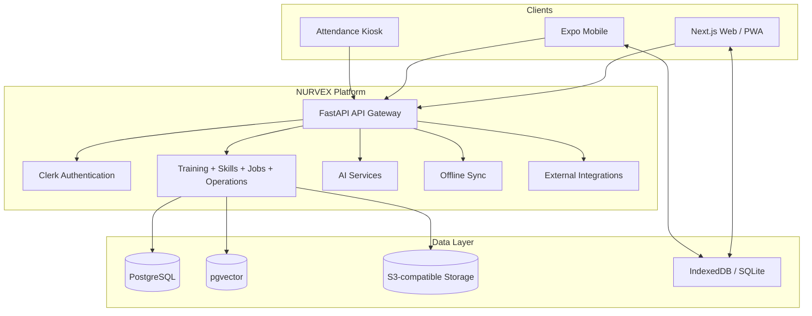
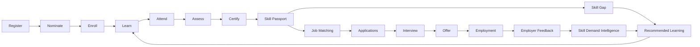

# NURVEX

> AI-powered learning, skill intelligence, certification, and employment ecosystem for India's cooperative sector.

<p align="center">
  
  
</p>

<p align="center">
  <strong>Learn → Prove → Certify → Build Skills → Get Matched → Get Hired → Improve the Ecosystem</strong>
</p>

<p align="center">
  NURVEX brings training, learning analytics, assessments, verified skills, career guidance, employers, and employment feedback into one measurable platform.
</p>

---

## Why NURVEX?

Traditional training systems often stop at course completion. NURVEX is designed around what happens after learning.

A trainee can move through a continuous evidence-backed journey:

```text
Registration
    ↓
Nomination
    ↓
Training
    ↓
Learning
    ↓
Attendance
    ↓
Assessment
    ↓
Certification
    ↓
Skill Passport
    ↓
Skill Gap Analysis
    ↓
Personalized Learning
    ↓
Job Matching
    ↓
Application
    ↓
Interview
    ↓
Offer / Employment
    ↓
Employer Feedback
    ↓
Skill Demand Intelligence
    ↓
Training Recommendations
```

This creates a closed-loop training-to-employment ecosystem instead of a collection of disconnected portals.

---

## What NURVEX Solves

- Digital programme registration, nomination, admission, and enrollment
- Institution and trainee profiles
- Cohort and self-paced learning
- Integrated learning content and progress tracking
- QR-based attendance with face-recognition integration points
- Timetables, hostel, and logistics workflows
- Assessments, grading, competency evidence, and certification
- Tamper-evident certificate verification
- AI-assisted career guidance
- Evidence-backed Skill Passport
- Skill-gap analysis and learning recommendations
- Explainable job and candidate matching
- Employer candidate discovery
- Applications, interviews, offers, and talent pools
- Employer feedback after hiring
- Skill-demand intelligence and analytics
- PWA/mobile experiences and offline-capable workflows
- Role-specific dashboards for trainees, trainers, institutions, employers, and administrators

---

## Core Product Modules

### Trainee

- Programme discovery, nomination, admission, and enrollment
- Self-paced and cohort learning
- Lesson and course progress tracking
- QR attendance and face-attendance integration
- Assessments and certificates
- Skill Passport and evidence history
- Skill-gap analysis
- Career goals and recommended learning
- Job recommendations and applications
- Interview workflows

### Trainer

- Assigned classes and batches
- Timetable and calendar
- Attendance sessions
- QR attendance
- Face-recognition integration
- Trainee roster
- Assessments and grading
- Assignments and learning content
- Skill evaluations
- Evidence submission
- Learning progress analytics
- At-risk learner indicators based on measurable activity
- Reports and communication

### Institution

- Programme management
- Nomination review
- Batch management
- Trainee enrollment
- Course and curriculum mapping
- Trainer assignment
- Timetable management
- Hostel allocation
- Logistics management
- Attendance monitoring
- Assessment reporting
- Institution analytics
- Announcements and communication

### Employer

NURVEX is not intended to be a generic job board. The employer experience is built around verified training evidence and skills.

- Structured job creation
- Skill and proficiency requirements
- Education, certificate, and experience requirements
- Candidate discovery
- Skill Passport review
- Evidence comparison
- Explainable match scores
- Applications
- Interviews
- Offers and hiring
- Talent pools
- Post-hire feedback

### Administrator / NCCT Workspace

- Institutions, trainers, trainees, and employers
- Programme and course management
- Certification and placement analytics
- Job and employment outcomes
- Skill-demand monitoring
- Reports and audit logs
- Platform configuration

---

## AI Intelligence

NURVEX uses AI where it adds value while keeping authoritative decisions reproducible and evidence-backed.

### AI Skill Passport

A learner's Skill Passport can evolve from:

```text
Course Completion
      +
Assessment Result
      +
Trainer Evaluation
      +
Certificate
      +
Employment Feedback
      ↓
Verified Skill Evidence
```

Each skill can maintain:

- Skill
- Proficiency
- Confidence
- Verification state
- Evidence source
- Evidence reference
- Last updated timestamp

### Skill Gap Analysis

```text
Current Skills
      vs
Target Role Requirements
      ↓
Matched Skills
Missing Skills
Weak Skills
      ↓
Recommended Learning
```

### Skill Graph

```text
Skills ↔ Courses ↔ Assessments ↔ Certificates ↔ Jobs ↔ Career Paths
```

### Explainable Job Matching

Core matching decisions are designed around deterministic scoring rather than opaque LLM-only decisions. Signals can include required skills, proficiency, education, certificates, experience, and semantic similarity where appropriate.

LLMs can explain and personalize results, while authoritative eligibility and scoring remain deterministic.

### AI Career Navigator

The career assistant can answer questions such as:

- What skills am I missing?
- What should I learn next?
- Which jobs fit me?
- Why am I not matching this role?
- What career path should I follow?
- Which course will close my biggest skill gap?

### AI-Assisted Interview

The interview experience can combine:

- Job-specific questions
- Candidate Skill Passport context
- Spoken questions
- Candidate voice answers
- Live transcription
- Dynamic follow-up questions
- Structured post-interview feedback

The system should evaluate relevant dimensions such as relevance, answer quality, clarity, communication, and role-specific knowledge. It should not make unsupported claims about emotions or mental state from facial appearance.

---

## Learning Content

NURVEX is designed so learners can consume supported educational resources without being sent through a chain of unrelated websites.

The content layer can integrate permitted sources such as:

- DIKSHA / Sunbird
- Officially embeddable video resources
- Approved open educational resources
- NURVEX-authored content

### DIKSHA / Sunbird Integration

```text
DIKSHA / Sunbird
       ↓
Content API / Metadata
       ↓
NURVEX Backend
       ↓
NURVEX Learning Experience
       ↓
Progress Tracking
       ↓
Assessment
       ↓
Certificate
       ↓
Skill Passport
```

License information must be preserved for every external resource. NURVEX must not assume that every resource is freely redistributable; content should only be embedded, streamed, copied, translated, or stored where the applicable terms and license permit it.

---

## Attendance & Hardware

NURVEX supports a digital attendance architecture suitable for institutional deployments.

### Attendance methods

- QR attendance
- Face-recognition integration
- Camera-based attendance workflows
- Kiosk deployment
- Online/offline synchronization

Reference architecture:

```text
Attendance Device / Kiosk
          ↓
      Edge Layer
          ↓
       FastAPI
          ↓
     PostgreSQL
          ↓
 Attendance Events
          ↓
 Training Analytics
```

Hardware-specific implementations remain modular so the platform is not tied to a single vendor.

---

## Architecture



### Closed-loop lifecycle



---

## Technology Stack

| Layer | Technology | Role |
|---|---|---|
| Web | Next.js 16, React 19, TypeScript | Main web application |
| UI | Tailwind CSS, Base UI, shadcn/ui, Lucide, Recharts | Interface and visualization |
| PWA | Service Worker, IndexedDB | Web offline capabilities |
| Mobile | Expo 57, React Native 0.86 | Mobile application |
| Mobile State | TanStack Query, Expo SQLite, Secure Store | Cache, outbox, sessions |
| API | FastAPI, Pydantic, Uvicorn | REST API and validation |
| ORM | SQLAlchemy | Database access |
| Database | PostgreSQL | Core relational data |
| Vector Search | pgvector | Semantic retrieval / skill intelligence |
| Migrations | Alembic | Schema versioning |
| Authentication | Clerk | Identity and authorization foundation |
| AI | Google Gemini and deterministic engines | Career, interview, recommendations |
| Integrity | HMAC-SHA256 | Certificate integrity |
| Testing | Pytest, ESLint, TypeScript, E2E scripts | Quality assurance |
| Infrastructure | Docker | Reproducible backend deployment |

---

## Repository Structure

```text
Cooperative-EcoSystem/
├── apps/
│   ├── web/
│   │   ├── public/
│   │   └── src/
│   │       ├── app/
│   │       ├── components/
│   │       └── lib/
│   │
│   └── mobile/
│       ├── src/
│       │   ├── api/
│       │   ├── features/
│       │   ├── i18n/
│       │   └── services/
│       ├── app.json
│       └── eas.json
│
├── backend/
│   ├── app/
│   │   ├── api/v1/
│   │   ├── models/
│   │   ├── schemas/
│   │   ├── services/
│   │   └── seeds/
│   ├── migrations/
│   ├── tests/
│   └── Dockerfile
│
├── docs/
├── scripts/
├── docker-compose.yml
└── README.md
```

---

## Key Engineering Principles

### Evidence before claims

Training outcomes should be linked to evidence. A certificate should not exist merely because a learner clicked "complete".

Evidence can include:

- Assessed performance
- Course completion
- Trainer evaluation
- Verified certificate
- Employment feedback

### Deterministic core, AI-assisted experience

AI is used for recommendations, explanations, career assistance, and interview dialogue. Authoritative operations such as certification integrity, structured scoring, permissions, and core matching logic should remain reproducible wherever possible.

### Privacy-aware design

- Server-side secrets
- Validated API inputs
- Authenticated protected routes
- Role-based access
- Organization scoping
- Audit logs
- Least-privilege access
- Explicit biometric consent where applicable

### Graceful degradation

Optional integrations should not cause the entire platform to fail. Integration capabilities should distinguish between:

```text
Configured
Implemented
Available
```

---

## Security Model

Roles represented by the platform include:

- `trainee`
- `trainer`
- `institution`
- `employer`
- `admin`
- `ncct_admin`

Security expectations:

- Validate untrusted input at API boundaries.
- Derive identity from authenticated claims rather than client-provided identity fields.
- Enforce organization scope on protected resources.
- Keep secrets out of `NEXT_PUBLIC_*` and `EXPO_PUBLIC_*`.
- Protect certificate signing keys.
- Avoid production use of demo/anonymous authentication.
- Use explicit CORS allowlists.
- Maintain audit trails for security-sensitive mutations.

> Never enable demo authentication or anonymous actors against a production or remote database.

---

## Certificates & Verification

NURVEX can generate certificates with unique verification identifiers.

Example:

```text
NUR-2026-XXXXXX
```

Certificate integrity can be protected using a server-side HMAC-SHA256 digest.

Verification flow:

```text
Certificate
    ↓
Verification ID
    ↓
Public Verification Endpoint
    ↓
Recompute Integrity Digest
    ↓
VALID / INVALID / REVOKED
```

---

## Offline Architecture

### Web

- PWA shell
- IndexedDB cache
- Learning cache
- Deferred mutations
- Sync queue
- Retry state

### Mobile

- Expo SQLite
- Local outbox
- Cached user/course data
- Network-aware synchronization
- Secure session storage

Offline mode is feature-scoped. Authoritative authorization, some grading operations, and conflict-sensitive operations may remain online-only.

---

## API Surface

API routes are versioned under:

```text
/api/v1
```

| Prefix | Purpose |
|---|---|
| `/auth` | Authentication and provisioning |
| `/users` | User management |
| `/organisations` | Organizations |
| `/programmes` | Programmes, nominations, batches |
| `/courses` | Courses |
| `/learning` | Learning and progress |
| `/content/diksha` | DIKSHA content integration |
| `/assessments` | Assessments and attempts |
| `/attendance` | Attendance |
| `/face` | Face attendance integration |
| `/certificates` | Certificate issuance and verification |
| `/skills` | Skill Passport and evidence |
| `/career` | Career intelligence |
| `/jobs` | Jobs and matching |
| `/employer` | Employer workflows |
| `/analytics` | Analytics and reporting |
| `/admin` | Administration |
| `/timetable` | Timetable |
| `/hostel` | Hostel |
| `/logistics` | Logistics |
| `/offline-sync` | Deferred synchronization |
| `/notifications` | Notifications |
| `/system` | Integration capability state |

The OpenAPI document at `/openapi.json` is the canonical machine-readable API contract.

---

## Getting Started

### Prerequisites

- Node.js 20+
- npm 10+
- Python 3.12+
- PostgreSQL 15+
- PostgreSQL `vector` extension
- Docker
- Expo tooling for mobile development

### Clone

```bash
git clone https://github.com/mittai17/Cooperative-EcoSystem.git
cd Cooperative-EcoSystem
```

### Backend

```bash
cd backend

python3 -m venv .venv
source .venv/bin/activate

python -m pip install --upgrade pip
pip install -r requirements.txt

alembic upgrade head
python -m app.seed

uvicorn app.main:app --host 0.0.0.0 --port 8000 --reload
```

Useful endpoints:

```text
http://localhost:8000/health
http://localhost:8000/docs
http://localhost:8000/redoc
http://localhost:8000/openapi.json
```

### Web

```bash
cd apps/web
npm ci
npm run dev
```

Open `http://localhost:3000`.

### Mobile

```bash
cd apps/mobile
npm ci
npm run typecheck
npm start
```

For a physical device, point the client to a network-reachable backend rather than `localhost`.

---

## Environment Configuration

### Backend

Typical variables include:

```dotenv
DATABASE_URL=
APP_ENV=
LOG_LEVEL=
ALLOWED_ORIGINS=

CLERK_SECRET_KEY=
CLERK_PUBLISHABLE_KEY=
CLERK_JWT_ISSUER=

CERTIFICATE_SIGNING_SECRET=

GEMINI_API_KEY=
YOUTUBE_API_KEY=

BHASHINI_USER_ID=
BHASHINI_API_KEY=

FACE_MODEL_PACK=
FACE_MATCH_THRESHOLD=
FACE_MIN_DET_SCORE=

MEDIA_BASE_URL=
CRON_SECRET=
```

Only configure variables required by the integrations you actually enable.

### Web

```dotenv
NEXT_PUBLIC_API_URL=http://localhost:8000
NEXT_PUBLIC_MOCK_API=false
```

### Mobile

```dotenv
EXPO_PUBLIC_API_BASE_URL=http://192.168.1.10:8000
EXPO_PUBLIC_CLERK_PUBLISHABLE_KEY=
```

Never place server secrets in public client variables.

---

## Database

The database uses PostgreSQL with pgvector.

Migration workflow:

```bash
cd backend
alembic current
alembic upgrade head
```

Create a migration only after an intentional schema change:

```bash
alembic revision --autogenerate -m "describe_change"
```

Always review generated migrations before applying them.

---

## Testing

### Backend

Scratch-database testing reduces the risk of running tests against a remote or production database.

```bash
docker run --name coopsetu-scratch-pg \
  -e POSTGRES_PASSWORD=postgres \
  -e POSTGRES_DB=coopsetu_scratch \
  -p 127.0.0.1:55432:5432 \
  -d pgvector/pgvector:pg16

python scripts/scratch_backend.py alembic upgrade head
python scripts/scratch_backend.py pytest -q
```

### Web

```bash
cd apps/web
npm run lint
npx tsc --noEmit
npm run build
```

### Mobile

```bash
cd apps/mobile
npm run typecheck
npm run lint
npx expo-doctor
```

### Closed-loop E2E

```bash
API_URL=http://127.0.0.1:8000 \
INTERNAL_API_SECRET=your-development-secret \
python scripts/verify_e2e_loop.py
```

---

## Data Model

Core domain concepts include:

```text
Users
Organizations
Institutions
Trainers
Trainees
Employers

Programmes
Nominations
Batches
Enrollments

Courses
Modules
Lessons
Assessments
Assessment Results
Learning Progress

Attendance
Attendance Events
Timetables
Hostel
Logistics

Skills
Skill Relationships
Trainee Skills
Skill Evidence
Skill Gaps
Career Paths

Jobs
Job Requirements
Job Matches
Applications
Interviews
Offers
Employer Feedback

Certificates
Certificate Verification

Analytics
Skill Demand
Employment Outcomes
Notifications
Audit Logs
Offline Sync
```

---

## Deployment

### Backend

```bash
docker build -t nurvex-api ./backend
docker run --rm -p 8000:8000 --env-file backend/.env nurvex-api
```

Run migrations as a controlled release step.

### Web

```bash
cd apps/web
npm ci
npm run build
npm start
```

### Mobile

```bash
cd apps/mobile
npx eas build --profile preview --platform android
npx eas build --profile production --platform android
```

---

## Production Readiness Checklist

- [ ] Disable anonymous/demo authentication
- [ ] Complete production Clerk session integration
- [ ] Configure HTTPS everywhere
- [ ] Lock CORS to trusted origins
- [ ] Store secrets in a managed secret store
- [ ] Protect certificate signing keys
- [ ] Configure managed PostgreSQL + pgvector
- [ ] Configure backups and restoration testing
- [ ] Validate external integrations
- [ ] Validate biometric consent and processing policies
- [ ] Test physical attendance hardware
- [ ] Validate offline conflict handling
- [ ] Add production monitoring
- [ ] Review all third-party content licenses
- [ ] Review privacy and data-retention policies

---

## Current Limitations

NURVEX is an actively evolving prototype. Current areas requiring additional production hardening include:

- Complete production-grade Clerk session integration across every web route
- Some presentation-heavy web screens still use local/demo data
- Production web containerization needs a validated web Dockerfile
- Face attendance requires separately supplied compatible model files and real-world validation
- Some external provider credentials are modeled before all adapters are fully implemented
- Native hardware workflows require physical-device validation
- AI remains advisory and should not replace human review for high-impact decisions
- Third-party educational content must be governed by source-specific licensing and usage terms

---

## Roadmap

### Phase 1 — Platform Foundation
- [x] Multi-role web application
- [x] FastAPI backend
- [x] PostgreSQL + pgvector architecture
- [x] Training and employment domain model
- [x] Certificate integrity foundation

### Phase 2 — Learning Intelligence
- [ ] Expand DIKSHA/Sunbird ingestion and playback
- [ ] Unified learning progress events
- [ ] Adaptive learning recommendations
- [ ] Advanced Skill Graph
- [ ] Richer assessment analytics

### Phase 3 — Employment Intelligence
- [ ] Expanded candidate intelligence
- [ ] Advanced interview workflows
- [ ] Employer feedback analytics
- [ ] Skill-demand forecasting
- [ ] Training-to-demand recommendations

### Phase 4 — Institutional Scale
- [ ] Large-scale institution rollout
- [ ] Kiosk/device management
- [ ] More robust offline synchronization
- [ ] Production observability
- [ ] Enterprise deployment hardening

---

## Contributing

Contributions are welcome.

1. Create a focused branch.
2. Keep changes modular.
3. Follow the existing architecture.
4. Add migrations for schema changes.
5. Add regression tests for important behaviors.
6. Validate authorization boundaries.
7. Update documentation when behavior changes.
8. Run lint, type checks, backend tests, and relevant E2E checks.

Good contribution areas include:

- DIKSHA/Sunbird integration
- Learning-player instrumentation
- Skill Graph enhancements
- Assessment analytics
- Employer intelligence
- Offline synchronization
- Accessibility
- Internationalization
- Test coverage

---

## Smart India Hackathon

**Smart India Hackathon 2026**  
**Problem Statement: 26087**  
**Theme: Smart Education**  
**Domain: Cooperative training, ERP, LMS, skills, and employment ecosystem**

NURVEX is designed around the challenge of connecting cooperative-sector capacity building with digital learning, measurable outcomes, skill development, and employment.

---

## License

No license file is currently present in this repository.

Until a license is explicitly added by the maintainers, the repository remains subject to applicable default copyright restrictions.

Do not assume the code or third-party assets are available for unrestricted redistribution.

---

## Vision

> **Make learning measurable, skills verifiable, hiring explainable, and employment outcomes visible.**

```text
Learn
  ↓
Demonstrate
  ↓
Certify
  ↓
Build Skills
  ↓
Discover Opportunities
  ↓
Get Hired
  ↓
Capture Employer Feedback
  ↓
Understand Skill Demand
  ↓
Improve Training
  ↺
```

<p align="center">
  <strong>NURVEX — Learn. Prove. Grow. Work.</strong>
</p>
