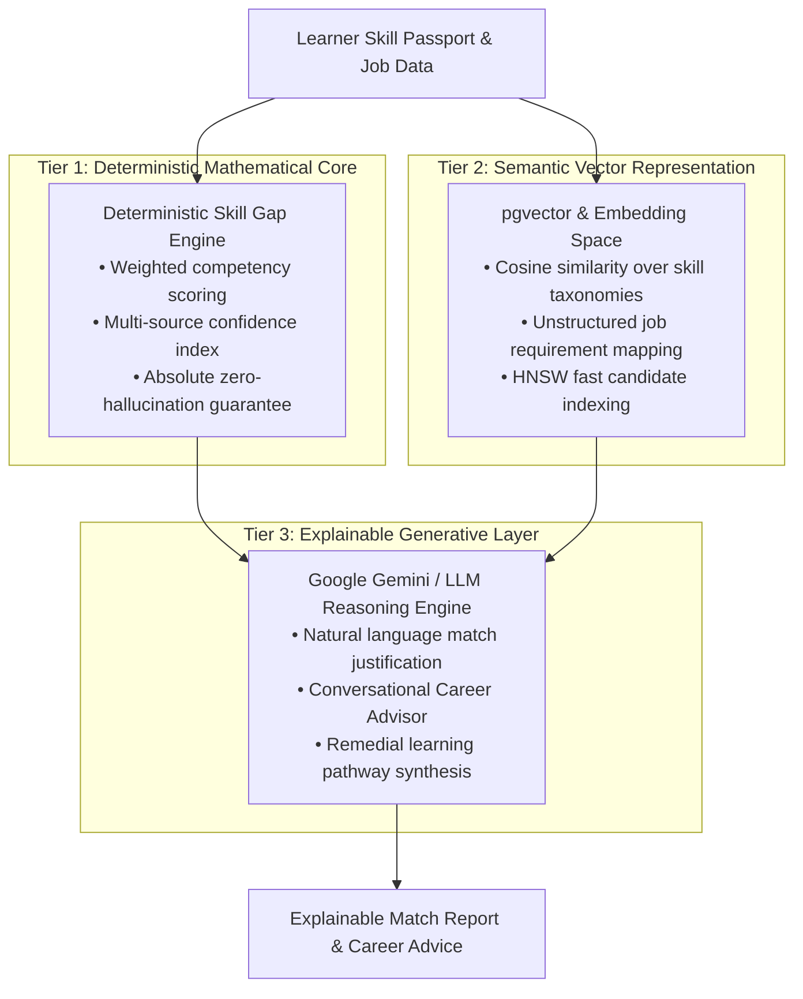

# CoopSetu AI — AI Engine Algorithms & Mathematical Framework

> **Smart India Hackathon 2026 | PS 26087**  
> *Deterministic Match Engines, Vector Embeddings & Explainable LLM Reasoning*  
> Document Version: 1.0.0

---

## 1. AI Architectural Principles

High-stakes governance systems—such as national cooperative job placement and certification—cannot rely solely on black-box probabilistic models that suffer from hallucinations or unexplainable biases. 

CoopSetu AI employs a **Three-Tier Hybrid AI Architecture**:



---

## 2. Deterministic Skill Gap Mathematics

### 2.1 Competency Level Quantization
Skills are quantized into a 4-point ordinal scale:
$$\mathcal{L} = \{\text{Foundational}: 1, \text{Intermediate}: 2, \text{Proficient}: 3, \text{Expert}: 4\}$$

Given a target role requirement $R = \{(s_i, l_i^{\text{req}}, w_i)\}_{i=1}^N$ where:
- $s_i$ is the skill identifier,
- $l_i^{\text{req}} \in \mathcal{L}$ is the minimum required proficiency level,
- $w_i \in (0, 1]$ is the competency importance weight.

### 2.2 Individual Skill Match Ratio
For each required skill $s_i$, if the learner possesses verified level $l_i^{\text{current}} \in \mathcal{L}$:
$$\text{MatchPct}(s_i) = \min\left(1.0, \frac{\mathcal{L}(l_i^{\text{current}})}{\mathcal{L}(l_i^{\text{req}})}\right)$$
If the learner has not demonstrated skill $s_i$, $\text{MatchPct}(s_i) = 0$.

### 2.3 Weighted Overall Role Match Score
The overall role readiness score $\mathcal{S}_{\text{role}} \in [0, 100]$ is computed as:
$$\mathcal{S}_{\text{role}} = \left( \frac{\sum_{i=1}^N w_i \cdot \text{MatchPct}(s_i)}{\sum_{i=1}^N w_i} \right) \times 100$$

### 2.4 Competency Classification Logic
Every skill in the requirement profile is partitioned into three mutually exclusive sets:
$$\text{Status}(s_i) = \begin{cases}
\mathbf{Met} & \text{if } \mathcal{L}(l_i^{\text{current}}) \ge \mathcal{L}(l_i^{\text{req}}) \\
\mathbf{Gap} & \text{if } 0 < \mathcal{L}(l_i^{\text{current}}) < \mathcal{L}(l_i^{\text{req}}) \\
\mathbf{Missing} & \text{if } s_i \notin \text{LearnerSkills}
\end{cases}$$

---

## 3. Dynamic Multi-Source Confidence Scoring

A skill in the AI Skill Passport is not binary; it carries a dynamic confidence score $\mathcal{C}(s) \in [0, 100\%]$ derived from multi-source evidence:

$$\mathcal{C}(s) = \left( \sum_{e \in \mathcal{E}(s)} \alpha_e \cdot \text{Score}(e) \right) \cdot \delta(t)$$

### Evidence Weights ($\alpha_e$)
| Evidence Type ($e$) | Weight ($\alpha_e$) | Validation Mechanism |
|---|:---:|---|
| **Accredited Programme Certificate** | 0.40 | Cryptographically signed certificate issued by RICM/ICM |
| **Proctored Course Assessment** | 0.30 | Graded test score ($\ge 75\%$) |
| **Faculty Practical Evaluation** | 0.20 | Direct grading by certified trainer in workshop |
| **Post-Hire Employer Rating** | 0.10 | 30/60/90-day supervisor feedback rating |

### Recency Decay Function ($\delta(t)$)
To account for skill atrophy over time:
$$\delta(t) = \exp\left(-\lambda \cdot \max(0, t - t_{\text{grace}})\right)$$
Where $t$ is the elapsed months since last verified evidence, $t_{\text{grace}} = 12\text{ months}$, and $\lambda = 0.015$.

---

## 4. Semantic Matching via `pgvector`

When matching unstructured job postings (e.g. natural language vacancy advertisements) against learner profiles, CoopSetu employs dense vector embeddings:

### Vector Similarity Metric
For candidate skill embedding vector $\mathbf{u} \in \mathbb{R}^{d}$ and job requirement vector $\mathbf{v} \in \mathbb{R}^{d}$ ($d = 1536$):
$$\text{Sim}_{\text{cosine}}(\mathbf{u}, \mathbf{v}) = \frac{\mathbf{u} \cdot \mathbf{v}}{\|\mathbf{u}\|_2 \|\mathbf{v}\|_2} = 1 - \mathcal{D}_{\text{cosine}}(\mathbf{u}, \mathbf{v})$$

### Hybrid Matching Score
To preserve the precision of verified credentials while allowing semantic flexibility:
$$\mathcal{S}_{\text{hybrid}} = \beta \cdot \mathcal{S}_{\text{deterministic}} + (1 - \beta) \cdot \left( \text{Sim}_{\text{cosine}} \times 100 \right)$$
*Default: $\beta = 0.70$ (70% deterministic weight, 30% semantic affinity).*

---

## 5. Explainable Reasoning & LLM Generation

Generative models (Google Gemini Pro / Flash) are utilized strictly in an **Explanation and Advisory Capacity**, never as an ungrounded scorer.

### Prompt Grounding Structure
```markdown
[SYSTEM]
You are CoopSetu AI's Cooperative Career Navigator. You provide strictly grounded advice based on verified candidate credentials and national NCCT cooperative job market data. Do not hallucinate qualifications.

[CANDIDATE CONTEXT]
- Name: Ravindra Suresh Patil
- Verified Skills:
  * Cooperative Management (Proficient, Confidence: 92%, Evidence: CST-2026-DAI-00842)
  * Communication & Facilitation (Proficient, Confidence: 85%)
  * Dairy Operations (Proficient, Confidence: 94%)
- Target Role: Dairy Procurement Supervisor (Amul)
- Overall Match: 88%
- Met Competencies: [Dairy Operations, Communication]
- Gaps Identified: [Cold Chain Management (Intermediate required, none verified)]

[TASK]
1. Explain why the candidate is shortlisted for this role.
2. Highlight the single highest-impact course to eliminate the remaining gap.
3. Formulate the response in professional, empowering language.
```

### Generated Output Example
> *"You have an **88% match** for the **Dairy Procurement Supervisor** role at Amul. Your verified certification in Dairy Operations (94% confidence) and strong communication ratings directly fulfill Amul's primary criteria. To close the remaining gap in **Cold Chain Logistics**, we recommend enrolling in the 4-week NCCT module 'Agri-Cold Chain Fundamentals' which will increase your match score to 96%."*
