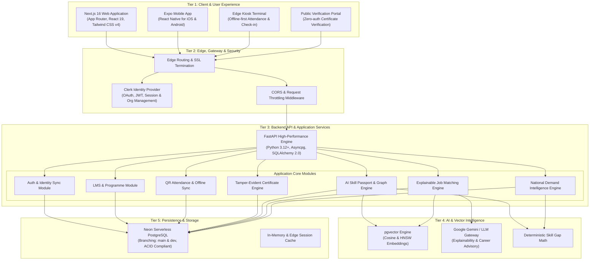
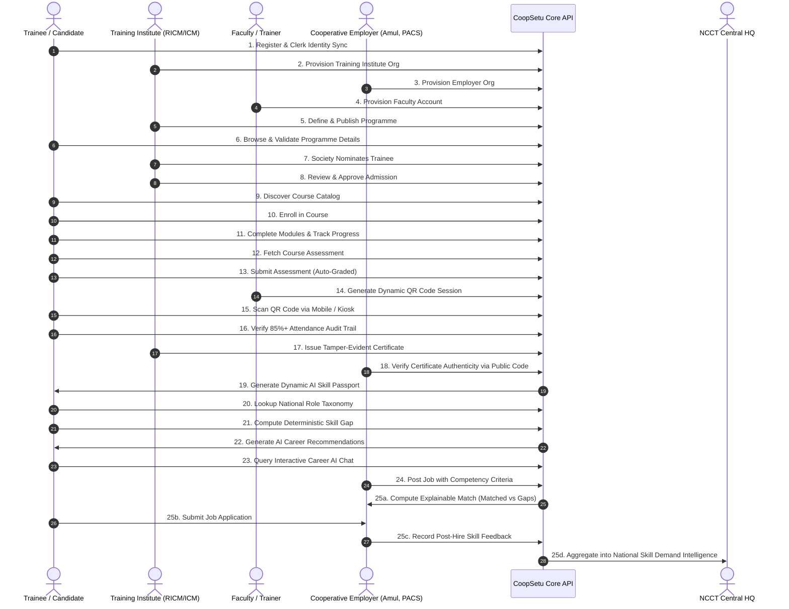

# CoopSetu AI — System Architecture & Data Flow

> **Smart India Hackathon 2026 | PS 26087**  
> *AI & LMS Enabled Cooperative Ecosystem*  
> Document Version: 1.0.0 | Status: Production Design

---

## 1. Multi-Tier System Architecture

CoopSetu AI is engineered as an enterprise-grade, multi-tier distributed platform designed to operate seamlessly across high-bandwidth metropolitan institutes and rural cooperative training centers with intermittent internet connectivity.

---

## 2. The 25-Step Closed-Loop Lifecycle

The platform solves systemic labor and training mismatches in the Indian cooperative sector by closing the loop between education, certification, job placement, and post-placement feedback.

---

## 3. Data Flows Across Subsystems

### 3.1 Trainee Skill Acquisition & Credentialing Flow
1. **Nomination & Admission**: Primary Agricultural Credit Societies (PACS) or Dairy Cooperatives nominate members or staff for structured diploma/certificate programmes.
2. **Assessment & Evidence Logging**: When a learner completes quizzes, tests, or case study evaluations, each graded component generates an immutable evidence item (`SkillEvidence`) linking course ID, score, date, and verified competencies.
3. **Attendance Validation**: Dynamic QR tokens enforce physical classroom and practical lab presence. The system verifies attendance thresholds ($\ge 75\%$) before releasing the final evaluation.
4. **Certificate Generation**: Upon completion, the system generates a cryptographically signed serial identifier (format: `CST-YYYY-XXXXXXXX`) stored in `certificates`.

### 3.2 Explainable Job Matching Data Flow
1. **Job Requirement Extraction**: Employer posts positions with explicit skill requirements and expected proficiency levels (*Foundational, Intermediate, Proficient, Expert*).
2. **Deterministic Evaluation**: The AI engine compares the applicant's verified skill level against the required level:
   $$\text{Score}(s) = \min\left(1.0, \frac{\text{Candidate Level Value}}{\text{Job Required Level Value}}\right)$$
   $$\text{Overall Match} = \frac{\sum_{i=1}^N w_i \cdot \text{Score}(s_i)}{\sum_{i=1}^N w_i} \times 100$$
3. **Missing Competency Categorization**: Every skill is bucketed into *Matched*, *Gap* (competency present but below target level), or *Missing* (competency absent).
4. **Actionable Remediation**: For every gap, the recommendation engine maps remedial accredited modules from the national catalog.

### 3.3 Closed-Loop Employer Feedback & Curriculum Adaptation Flow
1. **Post-Placement Survey**: After 30–90 days on the job, the cooperative employer evaluates the placed trainee across useful skills, missing skills, and training relevance (1–5 scale).
2. **Aggregated Demand Updates**: Feedback records automatically increment the demand count and deficit count in `skill_demand`.
3. **NCCT Macro Dashboard**: NCCT directors can view real-time surplus and shortage trends nationwide, allowing data-backed allocation of training budgets and rapid updates to syllabi.

---

## 4. Low-Connectivity & Offline Kiosk Architecture

In remote regional cooperative training centers where broadband internet is unreliable:

1. **Local SQLite / IndexedDB Storage**: The edge kiosk runs a client-side local cache storing active student roll numbers and scheduled session tokens.
2. **Cryptographic QR Cards**: Trainees carry dynamic or static QR badges containing signed candidate tokens.
3. **Offline Ingestion Queue**: If the kiosk loses internet connectivity:
   - Trainee scans are validated locally and appended to an offline JSON append-only journal.
   - The UI indicates "Offline Mode — Stored Locally".
4. **Idempotent Background Synchronization**: When network connectivity is restored:
   - The kiosk background worker submits batches of stored check-ins to `/api/v1/attendance/scan`.
   - The backend checks for duplicate timestamps and records attendance idempotently without data loss.

---

## 5. Security & Verification Architecture

- **Tamper-Evident Certificates**: Each certificate is associated with an unforgeable alphanumeric hash generated via cryptographic entropy. The public endpoint `/api/v1/certificates/verify/{code}` does not require login, enabling instant verification on physical printed diplomas.
- **Clerk Identity & RBAC**: Requests are authenticated using RS256-signed JWTs verified against Clerk's JWKS endpoint. 
- **Tenancy Isolation**: Multi-tenant database schema ensures that institutions and employers only access candidate data according to permissible RBAC scopes.
