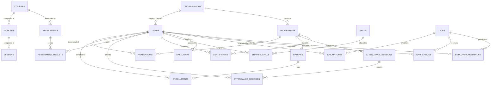

# CoopSetu AI — Database Schema & Data Models Specification

> **Smart India Hackathon 2026 | PS 26087**  
> *Database Engine: Neon Serverless PostgreSQL with pgvector (0.8.6)*  
> Document Version: 1.0.0

---

## 1. Entity-Relationship (ER) Diagram



---

## 2. Table Specifications & Data Dictionaries

### 2.1 Identity & Organization Tier

#### `organisations`
Stores participating entities including NCCT Headquarters, Regional Institutes of Cooperative Management (RICMs), Institutes of Cooperative Management (ICMs), and cooperative employers (Amul, IFFCO, KRIBHCO, PACS).

| Column Name | Type | Constraints | Description |
|---|---|---|---|
| `id` | `UUID` | Primary Key, default `uuid_generate_v4()` | Unique organisation identifier |
| `name` | `VARCHAR(255)` | NOT NULL | Official registered name |
| `type` | `VARCHAR(50)` | NOT NULL | `ncct`, `institution`, `employer`, `pacs` |
| `state` | `VARCHAR(100)` | Nullable | Indian State / UT of operation |
| `is_active` | `BOOLEAN` | Default `TRUE` | Soft deletion status |
| `created_at` | `TIMESTAMPTZ` | Default `NOW()` | Registration timestamp |

#### `users`
Platform user accounts synchronized bidirectionally with Clerk via webhook events.

| Column Name | Type | Constraints | Description |
|---|---|---|---|
| `id` | `UUID` | Primary Key, default `uuid_generate_v4()` | Internal user identifier |
| `clerk_user_id` | `VARCHAR(255)` | UNIQUE, NOT NULL, INDEXED | External Clerk identity reference (`user_...`) |
| `email` | `VARCHAR(255)` | UNIQUE, NOT NULL | Primary contact email address |
| `full_name` | `VARCHAR(255)` | Nullable | Legal full name |
| `role` | `VARCHAR(50)` | NOT NULL, Default `'trainee'` | `trainee`, `institution`, `trainer`, `employer`, `admin` |
| `organisation_id` | `UUID` | Foreign Key (`organisations.id`), Nullable | Linked organisation membership |
| `is_active` | `BOOLEAN` | Default `TRUE` | Account active state |
| `created_at` | `TIMESTAMPTZ` | Default `NOW()` | Account creation timestamp |
| `updated_at` | `TIMESTAMPTZ` | Default `NOW()` | Last modification timestamp |

---

### 2.2 Academic Programmes & Admission Tier

#### `programmes`
Accredited training programmes governed by NCCT and conducted by RICM/ICM institutions.

| Column Name | Type | Constraints | Description |
|---|---|---|---|
| `id` | `UUID` | Primary Key | Programme identifier |
| `title` | `VARCHAR(255)` | NOT NULL | Programme title |
| `sector` | `VARCHAR(100)` | Nullable | Domain: *Dairy, Credit, Banking, AgriTech* |
| `level` | `VARCHAR(50)` | Default `'Foundation'` | *Foundation, Intermediate, Advanced* |
| `mode` | `VARCHAR(50)` | Default `'In-person'` | *In-person, Online, Blended* |
| `duration_weeks` | `INTEGER` | Nullable | Length of programme in weeks |
| `seats_total` | `INTEGER` | Default 0 | Total seat quota |
| `seats_filled` | `INTEGER` | Default 0 | Enrolled candidate count |
| `organisation_id` | `UUID` | Foreign Key (`organisations.id`) | Conducting institute |
| `start_date` | `TIMESTAMPTZ` | Nullable | Scheduled commencement date |
| `is_active` | `BOOLEAN` | Default `TRUE` | Programme active flag |
| `description` | `TEXT` | Nullable | Detailed syllabus & overview |
| `created_at` | `TIMESTAMPTZ` | Default `NOW()` | Publication timestamp |

#### `nominations`
Sponsorship nominations submitted by cooperative societies to train members.

| Column Name | Type | Constraints | Description |
|---|---|---|---|
| `id` | `UUID` | Primary Key | Nomination tracking record |
| `trainee_id` | `UUID` | Foreign Key (`users.id`) | Nominated learner |
| `programme_id` | `UUID` | Foreign Key (`programmes.id`) | Selected programme |
| `status` | `VARCHAR(50)` | Default `'pending'` | `pending`, `approved`, `rejected` |
| `submitted_at` | `TIMESTAMPTZ` | Default `NOW()` | Application date |
| `reviewed_at` | `TIMESTAMPTZ` | Nullable | Institute review date |

#### `batches` & `enrollments`
Cohorts and active enrollments linked to specific academic periods.

---

### 2.3 Learning, Assessment & Attendance Tier

#### `attendance_sessions`
Dynamic classroom and workshop sessions created by trainers with expiring QR validation codes.

| Column Name | Type | Constraints | Description |
|---|---|---|---|
| `id` | `UUID` | Primary Key | Session identifier |
| `session_name` | `VARCHAR(255)` | Nullable | Session or module title |
| `programme_id` | `UUID` | Foreign Key (`programmes.id`), Nullable | Linked programme |
| `qr_token` | `VARCHAR(255)` | NOT NULL, INDEXED | Cryptographic random token |
| `valid_minutes` | `INTEGER` | Default 30 | Token validity duration |
| `created_at` | `TIMESTAMPTZ` | Default `NOW()` | Token generation timestamp |

#### `attendance_records`
Audit trail of recorded student check-ins.

| Column Name | Type | Constraints | Description |
|---|---|---|---|
| `id` | `UUID` | Primary Key | Attendance record ID |
| `session_id` | `UUID` | Foreign Key (`attendance_sessions.id`) | Session reference |
| `trainee_id` | `UUID` | Foreign Key (`users.id`) | Trainee identifier |
| `marked_at` | `TIMESTAMPTZ` | Default `NOW()` | Timestamp of check-in |
| `method` | `VARCHAR(50)` | Default `'qr'` | Check-in mode: `qr`, `manual`, `kiosk` |
| `status` | `VARCHAR(50)` | Default `'present'` | Attendance status |

#### `certificates`
Official accredited digital certificates with tamper-evident public verification codes.

| Column Name | Type | Constraints | Description |
|---|---|---|---|
| `id` | `UUID` | Primary Key | Certificate primary key |
| `trainee_id` | `UUID` | Foreign Key (`users.id`) | Certificate recipient |
| `programme_id` | `UUID` | Foreign Key (`programmes.id`) | Completed programme |
| `verification_code` | `VARCHAR(255)` | UNIQUE, NOT NULL, INDEXED | Public verification string (`CST-2026-XXXXXXXX`) |
| `issue_date` | `TIMESTAMP` | Default `NOW()` | Official date of issuance |
| `status` | `VARCHAR(50)` | Default `'valid'` | Status: `valid`, `revoked`, `expired` |
| `grade` | `VARCHAR(50)` | Default `'A'` | Academic performance grade |

---

### 2.4 AI Skills & Employment Tier

#### `jobs`
Employment opportunities posted by cooperative unions, banks, and apex federations.

| Column Name | Type | Constraints | Description |
|---|---|---|---|
| `id` | `UUID` | Primary Key | Job identifier |
| `title` | `VARCHAR(255)` | NOT NULL | Job designation |
| `employer_name` | `VARCHAR(255)` | Nullable | Posting organization name |
| `location` | `VARCHAR(255)` | Nullable | City / State posting location |
| `sector` | `VARCHAR(100)` | Default `'Cooperative'` | Cooperative branch |
| `job_type` | `VARCHAR(50)` | Default `'Full-time'` | Full-time, part-time, apprenticeship |
| `salary_range` | `VARCHAR(100)` | Nullable | Compensation bracket |
| `description` | `TEXT` | Nullable | Detailed job description |
| `skills_required` | `JSONB` | Nullable | Array of required skill competency objects |

#### `employer_feedbacks`
Post-placement evaluations submitted by employers that close the feedback loop into NCCT intelligence.

| Column Name | Type | Constraints | Description |
|---|---|---|---|
| `id` | `UUID` | Primary Key | Feedback identifier |
| `trainee_id` | `UUID` | Foreign Key (`users.id`), Nullable | Evaluated employee |
| `job_id` | `UUID` | Foreign Key (`jobs.id`), Nullable | Linked job vacancy |
| `useful_skills` | `JSONB` | Nullable | List of competencies demonstrated effectively |
| `missing_skills` | `JSONB` | Nullable | List of deficit competencies discovered on the job |
| `training_relevance` | `INTEGER` | Scale 1 to 5 | Rating of curriculum relevance |
| `performance_rating` | `INTEGER` | Scale 1 to 5 | Overall job performance rating |
| `comments` | `TEXT` | Nullable | Qualitative remarks |
| `created_at` | `TIMESTAMPTZ` | Default `NOW()` | Submission timestamp |

#### `skill_demand`
Aggregated macro intelligence consumed by NCCT Central HQ to detect workforce gaps.

| Column Name | Type | Constraints | Description |
|---|---|---|---|
| `id` | `UUID` | Primary Key | Demand record identifier |
| `skill_name` | `VARCHAR(255)` | NOT NULL, INDEXED | Normalized skill name |
| `employer_demand_count` | `INTEGER` | NOT NULL | Unfilled job opening requirements |
| `trained_count` | `INTEGER` | NOT NULL | Number of certified trainees available |
| `gap_count` | `INTEGER` | NOT NULL | Net national shortage (`demand - supply`) |
| `updated_at` | `TIMESTAMPTZ` | Default `NOW()` | Last recalculation date |

---

## 3. pgvector Integration & Semantic Search

CoopSetu leverages `pgvector` (v0.8.6) in Neon Postgres to compute semantic similarity between candidate skill profiles and unstructured job descriptions.

### Enabling the Extension
```sql
CREATE EXTENSION IF NOT EXISTS vector;
```

### Vector Column Definitions
In advanced matching scenarios, skills and job profiles include dense embedding vectors generated via transformer models or text-embedding-3-small:

```sql
-- Store 1536-dimensional semantic representations
ALTER TABLE skills ADD COLUMN IF NOT EXISTS embedding vector(1536);
ALTER TABLE jobs ADD COLUMN IF NOT EXISTS requirement_embedding vector(1536);

-- Approximate Nearest Neighbor (ANN) index using HNSW (Hierarchical Navigable Small World)
CREATE INDEX IF NOT EXISTS idx_skills_embedding_hnsw 
ON skills USING hnsw (embedding vector_cosine_ops)
WITH (m = 16, ef_construction = 64);

CREATE INDEX IF NOT EXISTS idx_jobs_embedding_hnsw 
ON jobs USING hnsw (requirement_embedding vector_cosine_ops)
WITH (m = 16, ef_construction = 64);
```

### Semantic Cosine Similarity Query
```sql
-- Find top 5 jobs semantically aligned with a candidate's skill vector
SELECT 
    id, 
    title, 
    employer_name,
    1 - (requirement_embedding <=> $1::vector) AS cosine_similarity
FROM jobs
WHERE 1 - (requirement_embedding <=> $1::vector) > 0.70
ORDER BY requirement_embedding <=> $1::vector ASC
LIMIT 5;
```
