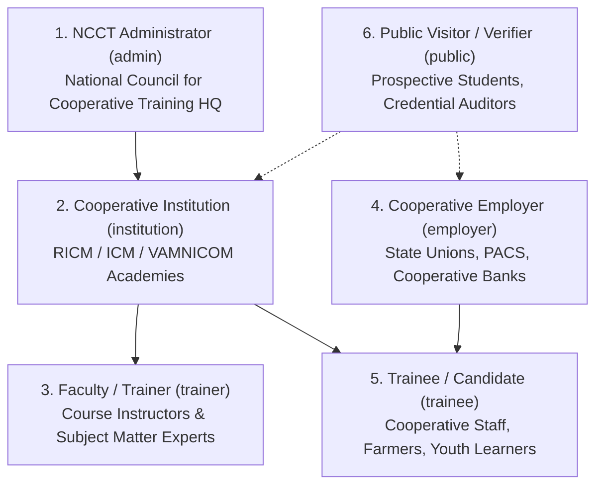
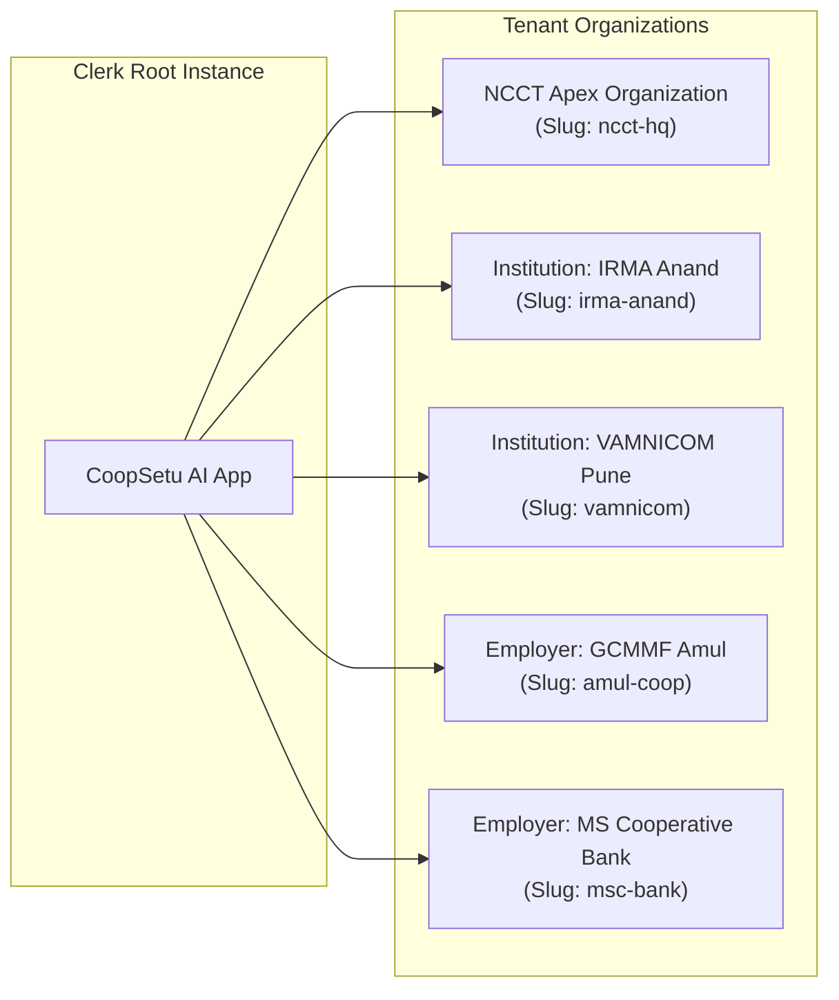

# CoopSetu AI — Role-Based Access Control (RBAC) & Permission Matrix

> **Smart India Hackathon 2026 | PS 26087**  
> *Identity Provider: Clerk Organizations & JWT Session Claims*  
> Document Version: 1.0.0

---

## 1. The 6 Platform Roles

CoopSetu AI defines 6 specialized roles aligning with the stakeholders of the Indian cooperative ecosystem:



### Role Descriptions
1. **`trainee` (Trainee / Learner)**: Enrolls in cooperative diplomas and courses, tracks learning milestones, logs dynamic QR attendance, maintains the AI Skill Passport, performs skill gap analyses, queries the AI career advisor, and applies for matched vacancies.
2. **`institution` (Training Institution / RICM / ICM)**: Publishes training programmes, evaluates trainee nominations from cooperative societies, manages batches, supervises attendance compliance, issues tamper-evident certificates, and monitors institutional placement rates.
3. **`trainer` (Faculty / Instructor)**: Manages class modules, creates dynamic QR attendance sessions, grades assessments, records practical skills, and provides faculty feedback on candidate capabilities.
4. **`employer` (Cooperative Employer / Society)**: Posts cooperative employment opportunities, defines competency requirements, reviews explainable candidate matches, submits post-placement 30/60/90-day skill evaluations, and views talent pools.
5. **`admin` (NCCT Central Administrator)**: Oversees nationwide institutions, monitors aggregated skill demand intelligence, tracks macro employment funnels, reconciles curriculum gaps, and manages national certification standards.
6. **`public` (Public Visitor / Verifier)**: Explores accredited programme offerings, browses open cooperative job listings, and verifies tamper-evident certificate authenticity using public verification codes (`CST-YYYY-XXXXXXXX`) without authentication.

---

## 2. Granular Permission Matrix

| Resource / Action | Trainee | Trainer | Institution | Employer | NCCT Admin | Public |
|---|:---:|:---:|:---:|:---:|:---:|:---:|
| **Public Programmes Catalog** | Read | Read | Read | Read | Read | Read |
| **Manage Programmes** | ❌ | ❌ | Create/Update | ❌ | Full CRUD | ❌ |
| **Submit Trainee Nominations** | ❌ | ❌ | Review/Approve | Create | View All | ❌ |
| **Course Enrollment** | Self | View Class | View Cohort | ❌ | View All | ❌ |
| **Take Assessments** | Self | View/Grade | View Cohort | ❌ | View All | ❌ |
| **Generate QR Attendance Session** | ❌ | Create | Create | ❌ | View All | ❌ |
| **Mark Attendance (Scan / Kiosk)** | Self | ❌ | Override | ❌ | ❌ | ❌ |
| **Issue Certificates** | ❌ | ❌ | Create | ❌ | Full CRUD | ❌ |
| **Verify Certificate (Public Hash)** | Verify | Verify | Verify | Verify | Verify | Verify |
| **View AI Skill Passport** | Self (RW) | View Class | View Cohort | View Matched | View All | ❌ |
| **Skill Gap Analysis** | Self | ❌ | View Aggregated | ❌ | View National | ❌ |
| **AI Career Navigator Chat** | Access | ❌ | ❌ | ❌ | Audit Logs | ❌ |
| **Post Job Openings** | ❌ | ❌ | ❌ | Full CRUD | Full CRUD | ❌ |
| **Explainable Candidate Matching** | View Score | ❌ | View Stats | Match/Filter | View All | ❌ |
| **Submit Job Applications** | Self | ❌ | ❌ | Review | View Stats | ❌ |
| **Post-Hire Feedback Loop** | ❌ | ❌ | View Ratings | Submit | View All | ❌ |
| **National Skill Demand Analytics** | ❌ | ❌ | Institute Level | Sector Level | Full National | ❌ |

---

## 3. Clerk Organization & Tenant Architecture

CoopSetu maps Indian cooperative governance into Clerk Multi-Tenant Organizations:



### Clerk Role to App Role Mapping

| Clerk Organization Role | CoopSetu Internal Role | Tenancy Scope | Permissions |
|---|---|---|---|
| `org:admin` (in NCCT Org) | `admin` | Global / National | Full administrative access, national analytics |
| `org:admin` (in Institute Org) | `institution` | Single Institution | Manage institute programmes, batches, certs |
| `org:trainer` (custom role) | `trainer` | Institute Department | Conduct sessions, generate QR, grade tests |
| `org:admin` (in Employer Org) | `employer` | Single Enterprise | Post jobs, candidate matching, submit feedback |
| `org:trainee` / No Org | `trainee` | Individual Learner | Skill passport, enrollment, job applications |
| Unauthenticated Session | `public` | Anonymous | Certificate verification, public catalog |

### User Metadata Structure
When users register or get provisioned, Clerk `public_metadata` is populated:
```json
{
  "role": "trainee",
  "organisation_id": "ea75a149-efb4-400b-86d1-b6e6fae76f2a",
  "designation": "PACS Cooperative Secretary Trainee",
  "state": "Maharashtra"
}
```

### Webhook Synchronization Pipeline
1. Changes in user state or role assignments in Clerk emit `user.created`, `user.updated`, or `organizationMembership.created` events.
2. The Next.js webhook receiver at `/api/webhooks/clerk` validates the Svix cryptographic signature (`svix-id`, `svix-timestamp`, `svix-signature`).
3. Validated payloads call `/api/v1/auth/sync` with an `X-Internal-Secret` to update Postgres synchronously.

---

## 4. Route & Gateway Protection

### Frontend Next.js Protection (`middleware.ts`)
Protected dashboard route trees are guarded based on role claims:
- `/dashboard/*` & `/skill-passport/*` $\rightarrow$ Allowed for `trainee`
- `/institution/*` $\rightarrow$ Restricted to `institution`
- `/trainer/*` $\rightarrow$ Restricted to `trainer`
- `/employer/*` $\rightarrow$ Restricted to `employer`
- `/admin/*` $\rightarrow$ Restricted to `admin`
- `/verify-certificate/*` & `/kiosk` $\rightarrow$ Publicly accessible

### Backend FastAPI Protection (`app/deps.py`)
```python
async def get_current_user_clerk_id(authorization: str = Header(None)) -> str:
    """Verifies RS256 token against Clerk JWKS public keys and yields user sub."""
    ...
```
Endpoints verify that `User.role` satisfies the required role enum before executing mutations.
